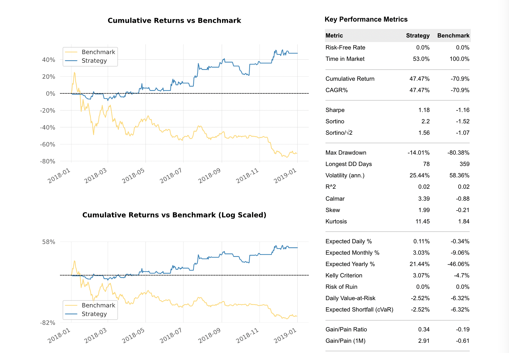
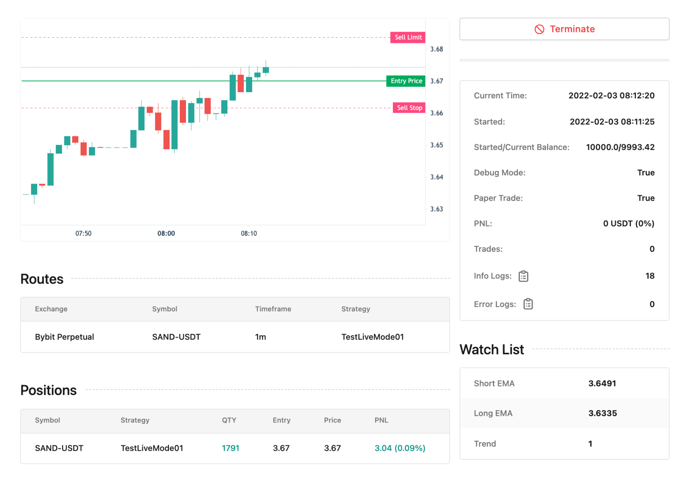

[](https://pypi.org/project/jesse)
[](https://pepy.tech/project/jesse)
[](https://hub.docker.com/r/salehmir/jesse)
[](https://github.com/jesse-ai/jesse)
[](https://codecov.io/gh/jesse-ai/jesse)

---

## Resources

- [⚡️ Website](https://jesse.trade)
- [🎓 Documentation](https://docs.jesse.trade)
- [🎥 Youtube channel (screencast tutorials)](https://jesse.trade/youtube)
- [🛟 Help center](https://jesse.trade/help)
- [💬 Discord community](https://jesse.trade/discord)

## Screenshots

Here are a few screenshots just to get you excited:

**Backtest results:**



**Example strategy code:**

```py
class SMACrossover(Strategy):
    @property
    def slow_sma(self):
        return ta.sma(self.candles, 200)

    @property
    def fast_sma(self):
        return ta.sma(self.candles, 50)

    def should_long(self) -> bool:
        # Fast SMA above Slow SMA
        return self.fast_sma > self.slow_sma

    def should_short(self) -> bool:
        # Fast SMA below Slow SMA
        return self.fast_sma < self.slow_sma

    def should_cancel_entry(self) -> bool:
        return False

    def go_long(self):
        # Open long position and use entire balance to buy
        qty = utils.size_to_qty(self.balance, self.price, fee_rate=self.fee_rate)

        self.buy = qty, self.price

    def go_short(self):
        # Open short position and use entire balance to sell
        qty = utils.size_to_qty(self.balance, self.price, fee_rate=self.fee_rate)

        self.sell = qty, self.price

    def update_position(self):
        # If there exist long position, but the signal shows Death Cross, then close the position, and vice versa.
        if self.is_long and self.fast_sma < self.slow_sma:
            self.liquidate()
    
        if self.is_short and self.fast_sma > self.slow_sma:
            self.liquidate()
```

**Live trading (requires [live plugin](https://docs.jesse.trade/docs/livetrade.html)):**



## How to contribute

Thank you for your interest in contributing to the project. The best way to contribute is by **participating in the community** and **helping other users**. 

You can also contribute by submitting **bug reports** and **feature requests** or writing code (submitting PRs) which can be incorporated into Jesse itself.

In that case, here's what you need to know:

- Before starting to work on a PR, please **reach out** to make sure it **aligns** with the **project's roadmap** and **vision**.
- If your PR makes changes to the source code, please make sure to **add unit tests**. If you're not sure how to do that, just check out some of the already existing [tests](https://github.com/jesse-ai/jesse/tree/master/tests).

First, you need to install Jesse from the repository instead of PyPi:

```sh
# first, make sure that the PyPi version is not installed
pip uninstall jesse

# now install Jesse from the repository
git clone https://github.com/jesse-ai/jesse.git
cd jesse
pip install -e .
```

Now every change you make to the code will be affected immediately.

After every change, **make sure** your changes did not **break** any functionality by **running tests**:
```
pytest
```

## Disclaimer
This software is for educational purposes only. USE THE SOFTWARE AT **YOUR OWN RISK**. THE AUTHORS AND ALL AFFILIATES ASSUME **NO RESPONSIBILITY FOR YOUR TRADING RESULTS**. **Do not risk money that you are afraid to lose**. There might be **bugs** in the code - this software DOES NOT come with **ANY warranty**.
